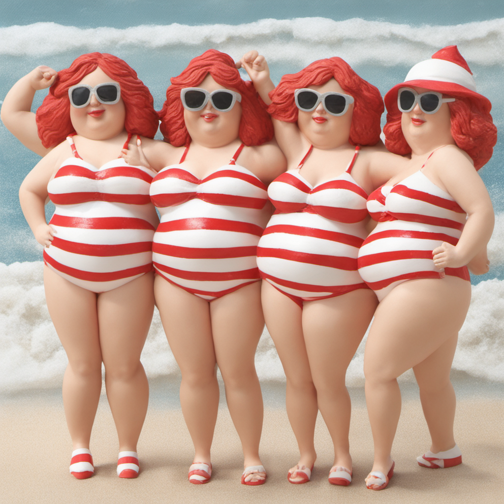

# XL Textual Inversion for [Stable Diffusion XL 1.0](https://huggingface.co/stabilityai/stable-diffusion-xl-base-1.0) SDXL on a 24 GB GPU
[*XL_Inversion.ipynb*](./XL_Inversion.ipynb) is **Copyright © 2023 [HANS ROETTGER](mailto:oss.roettger@posteo.org)** and distributed under the terms of **[AGPLv3](https://www.gnu.org/licenses/agpl-3.0.html)**.  

This is an implementation of the textual inversion algorithm to incorporate your own objects, faces or styles into Stable Diffusion XL 1.0.
Input: a couple of template images. Output: a concept ("Embedding") that can be used in the standard Stable Diffusion XL pipeline to generate your artefacts. (Please also note my [implementation variant for Deep Floyd IF.](https://github.com/oss-roettger/T5-Textual-Inversion))

**Please appreciate weeks of intensive work and leave me a ⭐ star in the top right!**

2023-11-16 Update: "time_ids" problems with newer diffusers versions solved (tested with 0.19.3 & 0.23.1). Thanks for the notice, Bo Sun!

## Input Images ➡ XL Embedding

<table style="width: 100%">
<tr>
    <td colspan=2></img></td>
    </tr>
</table>

The [XL_Inversion.ipynb](./XL_Inversion.ipynb) notebook creates an Embedding for your input images within 15 minutes on a Nvidia 3090 GPU. Starting with a random Embedding, the XL Textual Inversion will optimize it quickly to match your input images:  

<table style="width: 100%">
<tr>
    <td colspan=2></img></td>
    </tr>
</table>

## XL Embedding ➡ Stable Diffusion XL 1.0 Pipeline
Load the XL Embedding to a single token (e.g. "my") and use it in the standard Stable Diffusion XL prompts (see [*XL_Apply_Inversion.ipynb*](./XL_Apply_Inversion.ipynb))  

    def set_XLembedding(base,emb,token="my"):
    with torch.no_grad():            
        # Embeddings[tokenNo] to learn
        tokens=base.components["tokenizer"].encode(token)
        assert len(tokens)==3, "token is not a single token in 'tokenizer'"
        tokenNo=tokens[1]
        tokens=base.components["tokenizer_2"].encode(token)
        assert len(tokens)==3, "token is not a single token in 'tokenizer_2'"
        tokenNo2=tokens[1]
        embs=base.components["text_encoder"].text_model.embeddings.token_embedding.weight
        embs2=base.components["text_encoder_2"].text_model.embeddings.token_embedding.weight
        assert embs[tokenNo].shape==emb["emb"].shape, "different 'text_encoder'"
        assert embs2[tokenNo2].shape==emb["emb2"].shape, "different 'text_encoder_2'"
        embs[tokenNo]=emb["emb"].to(embs.dtype).to(embs.device)
        embs2[tokenNo2]=emb["emb2"].to(embs2.dtype).to(embs2.device)

    def load_XLembedding(base,token="my",embedding_file="myToken.pt",path="./Embeddings/"):
        emb=torch.load(path+embedding_file)
        set_XLembedding(base,emb,token)  
    
    learned="my"
    embs_path="./Embeddings/"
    emb_file="myPuppet768.pt"
    load_XLembedding(base,token=learned,embedding_file=emb_file,path=embs_path)
    
    prompt="The {} doll at the beach".format(learned)

<table style="width: 100%">
<tr>
    <td colspan=2></img></td>
    <td colspan=2></img></td>
    <td colspan=2></img></td>
    </tr>
</table>

    prompt="The 3D rendering of a group of {} figurines dressed in red-striped bathing suits having fun at the beach".format(learned)

<table style="width: 100%">
<tr>
    <td colspan=2></img></td>
    <td colspan=2></img></td>
    <td colspan=2></img></td>
    </tr>
</table>

    prompt="The 3D rendering of a group of {} figurines dressed in dirndl wearing sunglasses drinking beer and having fun at the Oktoberfest".format(learned)

<table style="width: 100%">
<tr>
    <td colspan=2></img></td>
    <td colspan=2></img></td>
    <td colspan=2></img></td>
    </tr>
</table>

    

## Prerequisites
* A working  [Stable Diffusion XL 1.0](https://huggingface.co/stabilityai/stable-diffusion-xl-base-1.0) environment
* A GPU with at least 24 GB CUDA memory and bfloat16 support

## Installation
* Copy the [*XL_Inversion.ipynb*](./XL_Inversion.ipynb) notebook into your Stable Diffusion XL 1.0 environment. All you need is in the small notebook.
* Customize the parameters in the first notebook cell to use your own input images and your local copy of the Stable Diffusion Xl models.
* Restart and run all!
